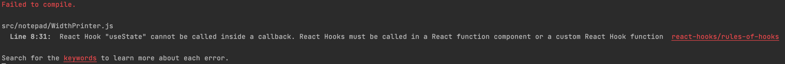

#### Effect Hook

`Side Effect`, 부수 효과를 다루는 Hook 이다. 일반적으로 side effect 라고 하면 부작용이라고 생각하는 부분들이 있는데
정확하게는 `Negative Side Effect` 의 경우가 우리가 흔히 아는 '의도치 않은 변경으로 인한 부작용' 이고, side effect 자체는 부작용이라는
부정적인 이미지는 아니다.

리액트 내에서 부수 효과는 여러가지를 의미하는데 `외부에서 내부의 상태값 변경 시` 를 의미한다.

단적인 예로는 시간이 오래 걸리는 서버에 요청하여 값을 반환하는 작업이라고 가정해보자면, 서버에 요청 후 값을 가지고 올때 Hook 이 아닌 직접적으로 수행하는 부수 효과가 있다면
값을 가져온 순간 렌더링을 시도할 것이고 그럴 경우 렌더링을 할 때 마다 해당 부수 효과가 중복으로 실행되게 된다.

```javascript
function App() {
  const [count, setCount] = useState(0);
  
  console.log('rendered');
  
  return (
      <>
        <p>{count}</p>
        <button onClick={e => { setCount(v => v + 1); } }>증가</button>
      </>
  );
}
```

위 상황에서 log 를 찍는 부분이 서버를 호출해서 값을 가져오는 것이라 가정하고, onclick 시 이벤트가 값을 변경하면 리액트는
렌더링을 시도할 것이고 (값이 변경되었기에) 값 변경 후 렌더링 과정에서 위의 로그 부분이 Hook 처리가 안되었기에 자연스럽게 다시 호출이 될 것이다.

```javascript
import React, {useEffect, useState} from 'react';

export default function EffectHook() {
  const [countState, setCountState] = useState({count1 : 0, count2 : 0});

  console.log('렌더링 될 때마다 ㄷㄷㄷㅈ');
  useEffect(() => {
    console.log('count2 가 바뀔때만 ㄷㄷㄷㅈ');
  }, [countState.count2]);

  return (
      <>
        <p>{countState.count1}, {countState.count2}</p>
        <button onClick={e => {setCountState({...countState, count1 : countState.count1 + 1});}}>count 1 증가</button>
        <button onClick={e => {setCountState({...countState, count2 : countState.count2 + 1});}}>count 2 증가</button>
      </>
  );
}
```

하지만 useEffect 에 두번째 매개변수로 state 값을 주면 해당 값이 변경 될때만 useEffect 가 실행되어 내부 로직을 수행하게 된다.

이 부분을 의존성 배열이라고 칭한다.

의존성 배열이 비어 있을 경우 최초 1회 렌더링 이후에 실행이 되지 않는데 그 이유는 당연하게도, 리액트에게 `어떠한 값이 변할때 마다 수행해라`
라는 언급을 해주지 않은 셈이기 때문이다.

이 의존성 배열에 값을 넣을때는 지역 내에서 (function 내에서) 선언된 함수나, 변수를 넣어줘야 하는데, 그 이유로는 내부에서 값이 변경된 것에 대해
리액트는 반영을 해야 하기 떄문이다.

다만 setState 와 같은 특수한 함수의 경우에는 state 가 불변이고 함수 내용 자체도 불변이기 때문에 넣어주지 않아도 된다.

이와 같이 useEffect 를 사용할 때는 설계적인 부분에서 접근을 해야 하는 경우가 많이 있다.

```javascript
function SomeComponent() {
  const [count, setCount] = useState(0);
  
  function logging() {
    console.log({count});
  }
  useEffect(() => {
    console.log('effect on');
  }, [count, logging]);
  
  return <>
    <p>{count}</p>
    <button onClick={() => setCount(count + 1)}>증가</button>
    </>
}
```

이와 같은 컴포넌트가 있다고 가정을 해봤을 때 `logging` 함수의 경우 굳이 매 렌더링 시 마다 만들어질 필요도 없고, 해당 함수가 변경 될
이유도 없다. 

다만 내부에서 생성되어 호출되기 때문에 변경 시 마다 반영이 되게 의존성 배열에 추가가 되어야 하는데 (그렇게 하지 않는다면 린트 에러 발생)
이 경우 외부에서 호출하여 해당 컴포넌트가 외부의 함수를 쓰는 방식으로 한다면 의존성 배열에 추가될 필요도, 쓸데없이 로직에 끼어들어
가독성을 낮추지도 않게 된다.

이처럼 설계적인 부분에서 useEffect, useState 등을 잘 사용 해야 한다.

#### didMount, unmount

리액트 라이프 사이클에서 didMount Unmount 가 있는데, useEffect 를 통해서 해당 효과와 유사하게 구현이 가능하다.

```javascript
function UseEffect() {
  useEffect(() => {
    // ...
    console.log('did mount');
    return (() => {
      console.log('unmount')
    });
  }, []);
}
```

일단 위에 언급했던 대로 useEffect 의 첫번째 파라미터는 부수효과 시 실행되는 함수, 두번째는 해당 값이 변할 경우 useEffect 가 실행되는 state 를 지정하는 부분이다.



내부에서 호출하는 log 를 보면 알겠지만, 내부에서 사용할 때는 렌더링이 될 때 초기에 호출되고, return 시에는 함수 형태로 전달을 하는데
unmount 가 되는 시점에 실행이 된다.

즉 라이프 사이클에서 unmount 내에서 실행을 하는 부분을 useEffect 에서 return 을 통해 사용 할 수 있다.